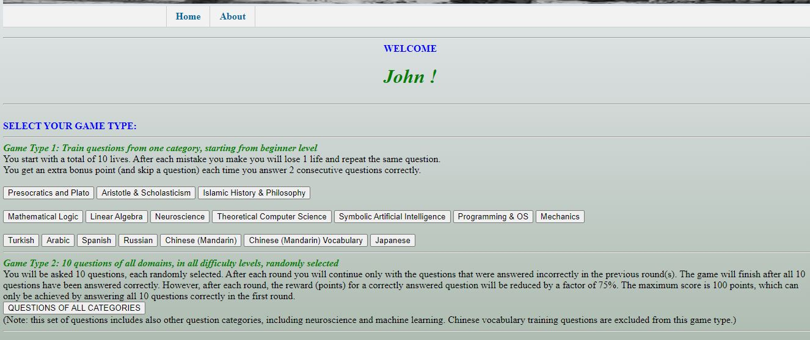
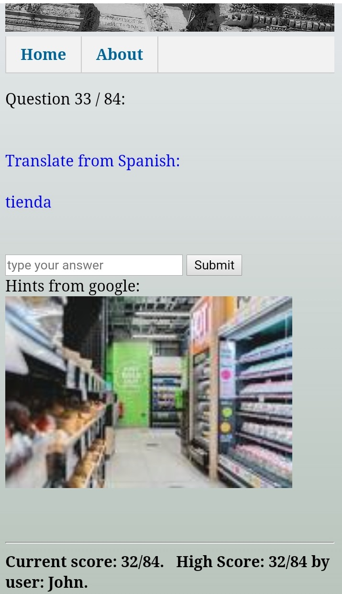

# flask-quiz-app
A quiz web-app based on the Flask Framework

## Table of contents
* [About](#about)
* [Technologies](#Technologies)
* [Screenshot](#screenshot)

## About
At the moment of writing, I have deployed the game on: https://brijnders.pythonanywhere.com/
This quiz game was intended to provide me some experience with using a back-end web framework and web scraping. 
At every question of the quiz, the Python code employs web scraping to accomodate the user with visual hints (using the beautiful soup tool). 
For this quiz game I have collected ~3000 questions, mainly on computer science, mathematics, philosophy, languages, neuroscience. 
Some of the questions were derived from lecture notes. Furthermore, 1500 Chinese Hanzi questions were also included.  
As such, this project has become a database that brings my otherwise unused lecture notes to life. 
And it provides a fun way for learning, memorizing or to recap whatever knowledge might be valuable. 

## Technologies
Project is created with:
* Python version: 2.6.9
* Flask version: 2.0.1
* beautifulsoup version: 4.10.0

## Screenshots

